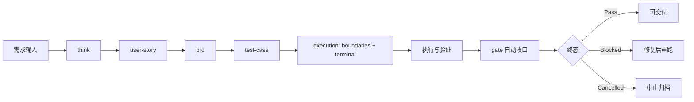

# Product Toolkit

> 把「需求想法」稳定地转成「可交付证据」。

Product Toolkit（PTK）是一套面向产品与研发协作的工作流工具。
它不只产出文档，还要求**范围清晰、证据可追溯、终态可判定**。

---

## 为什么用 PTK

很多团队的问题不是“不会写 PRD”，而是：

- 需求写完后，范围漂移
- 验收时，没人说得清“到底算不算完成”
- 文档、测试、执行证据彼此脱节

PTK 的目标很简单：

1. **先定义范围**（In/Out Scope）
2. **再生成标准产物链**（US/PRD/TC）
3. **最后用证据给出终态**（Pass / Blocked / Cancelled）

---

## PTK 的 3 条核心原则

### 1) 产物先行（Artifact-First）
先把产品语义沉淀成可读、可审、可复用的文档。

### 2) 证据闭环（Evidence-First）
不是“感觉完成”，而是 `AC → TC → Evidence → Terminal` 可追踪。

### 3) 范围守卫（Scope Guard）
触发越界时，必须记录 `deviations / confirmations`，避免“悄悄加需求”。

---

## 版本强一致规则（强制）

为避免“版本幻视漂移”，PTK 版本采用**强一致策略**：

1. CLI 显示版本、默认产品版本、插件元信息版本必须一致。
2. 文档入口（README/SKILL/commands）必须与当前发布版本一致。
3. 任何版本迭代（功能更新、文档更新、插件更新）必须同步修改版本标识。
4. `ptk doctor --json` 会执行 `version_consistency` 检查；不一致即 FAIL。

---

## 核心功能（你最常用的能力）

| 能力域 | 核心命令 | 产出/价值 |
|---|---|---|
| 需求澄清 | `think` | 收敛目标、约束、开放问题 |
| 需求落地 | `user-story` / `prd` | 形成可评审需求基线 |
| 验收设计 | `test-case` | 建立 AC→TC 映射 |
| 一键编排 | `workflow` (`work`) | 串联主路径，减少手工切换 |
| 范围守卫 | CLI Scope Guard | 越界即记录 `deviations/confirmations` |
| 终态门控 | `gate` + `workflow_gate_autorun.sh` | 给出 Pass/Blocked/Cancelled |
| 证据治理 | `raw-command-log` + `manifest` + `consistency` | 提升可追溯与审计可信度 |
| 版本迭代 | `version` / `roadmap` / `release` / `evolution-summary` | 支撑持续迭代与发布复盘 |

---

## 版本需求迭代工作流（推荐）

这是 PTK 的“版本级”执行节奏，适用于持续迭代：

1. **版本目标定义**  
   用 `version` 明确版本范围与里程碑。
2. **需求收敛与分解**  
   按功能执行 `think → user-story → prd`。
3. **验收前置**  
   用 `test-case` 建立可执行验证口径。
4. **范围与边界锁定**  
   在 `execution/boundaries.md` 固定 In/Out Scope、Done/Blocked 条件。
5. **执行与证据沉淀**  
   产出 `raw-command-log.jsonl`、`evidence-manifest.json`、`gate-consistency-report.json`。
6. **终态判定与发布决策**  
   运行 `workflow_gate_autorun.sh`，写入/校验 `terminal.json`。
7. **版本复盘与下一轮输入**  
   用 `test-progress` + `evolution-summary` 回流到下一版本需求池。

> 一句话：**每个版本都要形成“需求基线 + 验收基线 + 证据基线”。**

---

## 你会得到什么

执行主路径后，至少会得到这些关键产物：

- `docs/product/{version}/user-story/*.md`
- `docs/product/{version}/prd/*.md`
- `docs/product/{version}/qa/test-cases/*.md`
- `docs/product/{version}/execution/boundaries.md`
- `docs/product/{version}/execution/terminal.json`
- `docs/product/{version}/execution/summary.md`
- `docs/product/{version}/execution/summary.json`
- `docs/product/{version}/execution/raw-command-log.jsonl`
- `docs/product/{version}/execution/evidence-manifest.json`
- `docs/product/{version}/execution/gate-consistency-report.json`

---

## 3 分钟快速开始

### Step 1）跑主流程

```bash
/product-toolkit:workflow 社区点赞功能
```

### Step 2）执行终态收口

```bash
./scripts/workflow_gate_autorun.sh \
  --version v3.7.0 \
  --terminal docs/product/v3.7.0/execution/terminal.json
```

### Step 3）查看交付结果

- 人类报告：`docs/product/v3.7.0/execution/summary.md`
- 机器报告：`docs/product/v3.7.0/execution/summary.json`

### Step 4）进入版本迭代（可选）

```bash
/product-toolkit:version v3.8.0
/product-toolkit:roadmap v3.8.0
/product-toolkit:test-progress v3.7.0
/product-toolkit:evolution-summary v3.7.0
```

---

## 推荐主路径（v3.7.0 基线）



> 默认推荐入口：`/product-toolkit:workflow`（`/product-toolkit:work` 为别名）

---

## v3.7.0：CLI + Scope Guard（当前重点）

v3.7.0 增量关注点：

- CLI 统一入口与模式交互（normal / strict / debug / replay）
- Scope Guard 越界判定与确认机制
- 越界触发后强制记录：`deviations / confirmations`
- Dual-mode 报告：`summary.md + summary.json`
- 证据三件套：
  - `raw-command-log.jsonl`
  - `evidence-manifest.json`
  - `gate-consistency-report.json`

详细文档：

- `docs/product/v3.7.0/README.md`
- `docs/product/v3.7.0/prd/ptk-cli-scope-guard.md`
- `docs/product/v3.7.0/user-story/ptk-cli-scope-guard.md`
- `docs/product/v3.7.0/qa/test-cases/ptk-cli-scope-guard.md`

---

## 常用命令简述（README 快速参考）

### A. 产品工作流命令（对话层）

| 命令 | 简述 | 典型输出 |
|---|---|---|
| `/product-toolkit:think <主题>` | 需求澄清与冲突识别（think vNext） | 结构化澄清结论 |
| `/product-toolkit:user-story <功能>` | 生成用户故事与验收标准（AC） | `user-story/*.md` |
| `/product-toolkit:prd <功能>` | 生成 PRD 主文档 | `prd/*.md` |
| `/product-toolkit:test-case <功能>` | 生成测试用例与 AC→TC 映射 | `qa/test-cases/*.md` |
| `/product-toolkit:workflow <功能>` | 一键串联主路径（推荐入口） | US/PRD/TC + execution 产物 |
| `/product-toolkit:work <功能>` | workflow 别名 | 同 workflow |
| `/product-toolkit:gate` | 执行门控检查（strict 默认） | Pass/Blocked 判定 |
| `/product-toolkit:team <任务>` | 多代理协作执行 | 团队执行状态与报告 |
| `/product-toolkit:ralph-bridge <任务>` | OMX/OMC 兼容桥接路径 | bridge 状态与终态映射 |
| `/product-toolkit:status` | 查看当前状态面板 | team/gate/test 概览 |
| `/product-toolkit:remember / recall` | 写入/检索项目记忆 | `.ptk/memory/*` |
| `/product-toolkit:save / resume` | 会话状态保存/恢复 | `.ptk/state/*` |

### B. PTK CLI 子命令（执行层，`./ptk`）

| 子命令 | 简述 | 示例 |
|---|---|---|
| `status` | 查看 team/gate/bridge/test 状态 | `./ptk --version v3.7.0 status --board` |
| `run` | 执行 workflow 路由（支持 mode） | `./ptk --version v3.7.0 run workflow --mode strict` |
| `report` | 生成 dual-mode 报告 | `./ptk --version v3.7.0 report --human latest` |
| `debug watch` | 观察指定 run 的事件流 | `./ptk --version v3.7.0 debug watch <run_id> --follow` |
| `feedback sync` | 同步 run 的反馈到 requirement-feedback | `./ptk --version v3.7.0 feedback sync latest` |
| `resume` | 查看 run 详情（恢复上下文） | `./ptk --version v3.7.0 resume <run_id>` |
| `doctor` | 诊断 schema / 报告 / 终态一致性 | `./ptk --version v3.7.0 doctor --json` |

`run --mode` 简述：
- `normal`：标准执行
- `strict`：启用 Scope Guard + AC 约束（可 `--proposal` / `--confirm`）
- `debug`：输出调试事件流
- `dry-run`：只做路由与最小执行，不做真实推进
- `replay`：基于历史 run 回放（`--from-run`）

完整命令契约：`commands/product-toolkit.md`（权威定义）

---

## 交付前最小检查清单

在提交前，至少执行一次：

```bash
./scripts/workflow_gate_autorun.sh \
  --version v3.7.0 \
  --terminal docs/product/v3.7.0/execution/terminal.json
```

如需精查：

```bash
python3 scripts/validate_terminal_artifacts.py \
  --version v3.7.0 \
  --terminal docs/product/v3.7.0/execution/terminal.json \
  --pretty
```

---

## 目录导航

```text
product-toolkit/
├── commands/                 # 命令入口说明
├── skills/                   # 各能力技能定义（workflow/gate/team/...）
├── scripts/                  # 校验与自动收口脚本
├── docs/product/             # 分版本产品文档与执行证据
└── .ptk/                     # 本地运行态与记忆状态
```

---

## 安装

### Claude Code

```bash
claude plugin marketplace add /绝对路径/product-toolkit
claude plugin install product-toolkit@product-toolkit-dev
claude plugin list
```

### Codex

```bash
git clone https://github.com/justin-mc-lai/product-toolkit ~/.codex/product-toolkit
mkdir -p ~/.agents/skills
ln -s ~/.codex/product-toolkit ~/.agents/skills/product-toolkit
```

---

## 版本与文档入口

| 版本 | 状态 | 入口 |
|---|---|---|
| v3.7.0 | 文档与验证基线（CLI + Scope Guard） | `docs/product/v3.7.0/README.md` |
| v3.6.1 | 主路径热修基线 | `docs/product/v3.6.1/SUMMARY.md` |
| v3.6.0 | evidence-first 首版闭环 | `docs/product/v3.6.0/README.md` |

---

## 延伸阅读

- 根技能定义：`SKILL.md`
- 主流程技能：`skills/workflow/SKILL.md`
- 门控技能：`skills/gate/SKILL.md`

如果你希望，我可以继续补一版：
**“新成员 10 分钟 onboarding README（超简版）”**，用于团队内部快速上手。
